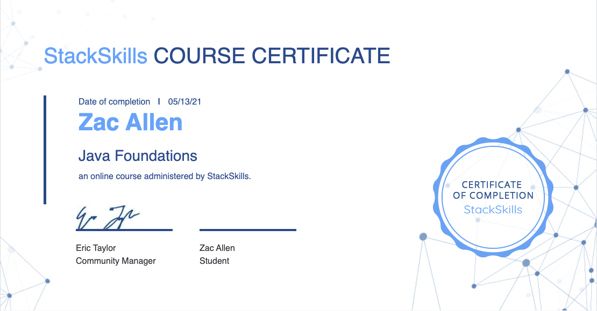

# Java Basics

Repository covering the basics of Java, from Java Foundations course on StackSocial.

Each "lesson" as it's own `Start` class due to the way course was taught, in reality, the `import` will be done at top of file, and

```
class Start {
    public static void main(String[] args) {
        // lessons here
    }
    } 
```

would be only declared once.


Certificate:
